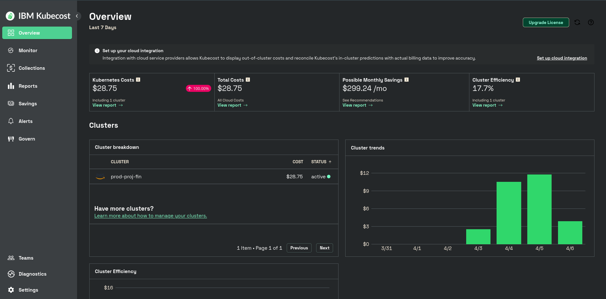
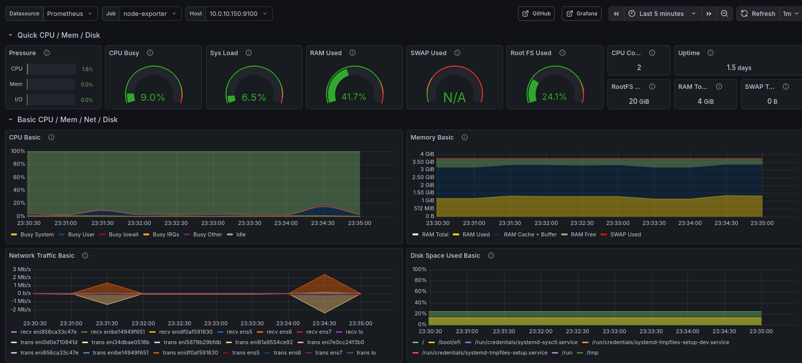

# Production Kubernetes Platform on AWS EKS

A production-grade Kubernetes platform built entirely with open-source tooling. Terraform provisions the AWS infrastructure, ArgoCD manages everything inside the cluster declaratively from this Git repository. No manual Helm installs, no manual kubectl applies after bootstrap.

**Stack:** EKS · Karpenter · ArgoCD · Traefik · cert-manager · CloudNativePG · Prometheus · Grafana · Loki · OpenTelemetry · Sealed Secrets · Cloudflare DNS

## Accessing Services

| Service | URL |
|---|---|
| ArgoCD | https://argocd.aws.homelain.click |
| Grafana | https://grafana.aws.homelain.click |
| Prometheus | https://prometheus.aws.homelain.click |
| Headlamp | https://headlamp.aws.homelain.click |
| Kubecost | https://kubecost.aws.homelain.click |
| OTel Demo | https://shop.aws.homelain.click |
| Jaeger | https://jaeger.aws.homelain.click |
| myapp  | https://myapp.aws.homelain.click |

---
**kubecost  dashboard**



**argocd dashboard**


**grafana dashboard**


**jaeger dashboard**


## What Terraform Creates

Terraform provisions all AWS infrastructure. The cluster state is stored in S3 with DynamoDB locking.

### Infrastructure

| Resource | Details |
|---|---|
| VPC | 10.0.0.0/16, multi-AZ |
| Public subnets | 2 × /24 across 2 AZs — NAT GW, bastion |
| Private subnets | 2 × /24 across 2 AZs — EKS nodes (tagged for Karpenter discovery) |
| NAT Gateway | Single, in public subnet — allows private nodes to pull images |
| Bastion EC2 | t2.micro in public subnet, kubectl + awscli pre-installed |
| Internet Gateway | Public subnet internet access |

### EKS

| Resource | Details |
|---|---|
| EKS Cluster | v1.34, public + private endpoint, API_AND_CONFIG_MAP auth mode |
| System Node Group | t3.medium × 2, tainted `CriticalAddonsOnly` — system pods only |
| OIDC Provider | Enables IRSA for Karpenter controller |
| Access Entries | KarpenterNodeRole (EC2_LINUX), root user (cluster-admin) |

### IAM

| Role | Purpose |
|---|---|
| `eks-cluster-role` | EKS control plane role |
| `KarpenterNodeRole` | Instance role for all Karpenter-launched nodes + instance profile |
| `KarpenterControllerRole` | IRSA role for Karpenter pod — scoped EC2/SQS permissions with ownership tag conditions |
| `system-node-role` | Managed node group role |

### Security Groups

| SG | Purpose |
|---|---|
| `control-plane-sg` | Attached to EKS cluster endpoint |
| `karpenter-node-sg` | Attached to every Karpenter node — tagged `karpenter.sh/discovery` |
| `bastion-sg` | SSH ingress from operator IP only |

Cross-SG rules allow: nodes → control plane (443), control plane → nodes (10250), node-to-node (all), bastion → control plane (443), bastion → nodes (22).

### Karpenter Infra

| Resource | Purpose |
|---|---|
| SQS Queue | Receives Spot interruption / rebalance events |
| EventBridge Rules | 4 rules → SQS (Spot interruption, rebalance, state change, health) |

### Terraform Module Structure

```
terraform/
├── main.tf                         ← root — wires all modules
├── variables.tf                    ← grouped by module
├── outputs.tf
├── providers.tf                    ← aws, kubernetes, helm providers
└── modules/
    ├── vpc/                        ← VPC, subnets, IGW, NAT, routes
    ├── security-groups/            ← 3 SGs + all cross-SG rules
    ├── iam-roles/                  ← cluster role, node role, system node role
    ├── iam-karpenter-controller/   ← Karpenter controller IRSA role
    ├── eks/                        ← cluster, OIDC, system node group, access entries
    ├── karpenter-infra/            ← SQS + EventBridge
    ├── bastion/                    ← EC2 bastion
    └── argocd/                     ← ArgoCD Helm install + root Application bootstrap
```

---

## ArgoCD Bootstrap — How It Works

Terraform installs ArgoCD via Helm and applies a single root `Application` CR pointing at this repo. From that point, this Git repository is the source of truth for everything in the cluster.

```
terraform apply
    └── installs ArgoCD (Helm)
    └── applies argocd-app-in-app/bootstrap-all.yaml
              │
              ▼
        ArgoCD reads bootstrap-all.yaml
        and creates child Applications in sync-wave order:
              │
        wave -5 │ karpenter-config     → NodePool + EC2NodeClass
                │   Karpenter provisions EC2 nodes
        wave -4 │ cert-manager-crds   → CRDs only
        wave -3 │ cert-manager        → TLS controller
                │ sealed-secrets      → secret decryption controller
        wave -2 │ cloudflare-secret   → decrypted API token in cert-manager ns
        wave -1 │ tls-config          → ClusterIssuer + wildcard cert + TLSStore
                │ traefik             → ingress controller + NLB
                │ cloudnative-pg      → PostgreSQL operator
        wave  0 │ kube-prometheus-stack → Prometheus + Grafana + Alertmanager
                │ headlamp            → Kubernetes dashboard
                │ metrics-server      → HPA + kubectl top
                │ kubecost            → cost visibility
                │ otel-demo           → instrumented demo application
        wave  1 │ ingress-routes      → all IngressRoute CRs
```

ArgoCD will not proceed to the next wave until all resources in the current wave are healthy. Each Application watches its corresponding path in this repo and reconciles every 3 minutes.

---

## Repository Structure

```
.
├── argocd-app-in-app/
│   └── bootstrap-all.yaml          ← apply once to seed everything
│
├── karpenter-manifest/
│   ├── ec2nodeclass.yaml           ← AMI, subnet + SG selectors, instance tags
│   └── nodepool.yaml               ← instance families, capacity type, disruption policy
│
├── apps/
│   ├── tls/
│   │   ├── cluster-issuer.yaml     ← Let's Encrypt via Cloudflare DNS-01
│   │   ├── wildcard-certificate.yaml ← *.aws.homelain.click
│   │   └── tls-store.yaml          ← Traefik default cert for all IngressRoutes
│   ├── secrets/
│   │   └── cloudflare-api-token.yaml ← SealedSecret (safe to commit)
│   └── ingress/
│       ├── grafana-ingress.yaml
│       ├── headlamp-ingress.yaml
│       ├── kubecost-ingress.yaml
│       ├── prometheus-ingress.yaml
│       ├── otel-demo-ingress.yaml
│       └── jaeger-ingress.yaml
│
└── my-application/
    ├── argoproj-this-app.yaml      ← ArgoCD Application for the demo app
    ├── deployment.yaml
    ├── service.yaml
    ├── ingress-route.yaml
    └── cnpg-cluster-pooler.yaml    ← PostgreSQL Cluster + PgBouncer Pooler
```

---

## What Each Tool Does

| Tool | Role |
|---|---|
| **Karpenter** | Watches for unschedulable pods and provisions the right EC2 instance type on demand. Consolidates underutilized nodes automatically. Uses EventBridge/SQS for 2-minute Spot interruption warning and graceful drain. |
| **Traefik** | Single ingress controller — one AWS NLB handles all HTTPS traffic. Routes by hostname to the correct service. Reads `IngressRoute` CRDs. No per-service load balancer needed. |
| **cert-manager** | Watches for `Certificate` resources and automatically issues TLS certs from Let's Encrypt using Cloudflare DNS-01 challenge. Renews before expiry. |
| **external-dns** | Watches `IngressRoute` hostnames and creates/updates DNS A records in Cloudflare automatically. |
| **Sealed Secrets** | Encrypts Kubernetes secrets using the cluster's public key so they can be safely committed to Git. Only the cluster can decrypt them. |
| **CloudNativePG** | PostgreSQL operator. Manages primary + replica lifecycle, automated failover, WAL archiving to S3, and PgBouncer connection pooling via the `Pooler` CR. |
| **kube-prometheus-stack** | Installs Prometheus (metrics collection), Grafana (dashboards), Alertmanager, node-exporter (per-node metrics), and kube-state-metrics in one chart. Pre-loaded dashboards for cluster, Karpenter, and nodes. |
| **Loki + Promtail** | Log aggregation. Promtail runs as a DaemonSet on every node and ships pod logs to Loki. Queryable from Grafana using LogQL. |
| **OpenTelemetry Demo** | The Astronomy Shop — a 10-service microservices app pre-instrumented with OpenTelemetry. Generates real traces, metrics, and logs. Used to demonstrate the full observability stack. |
| **Kubecost** | Real-time cost breakdown by namespace, deployment, and node. Uses Prometheus data + AWS pricing to show per-workload cost. |
| **Headlamp** | Open-source Kubernetes dashboard with cluster-admin access. Provides a web UI for viewing pods, deployments, logs, and events. |
| **Metrics-server** | Aggregates CPU and memory usage from kubelets. Required for `kubectl top nodes/pods` and Horizontal Pod Autoscaler. |

---

## TLS Flow

Every service gets HTTPS automatically. Adding a new service requires only an `IngressRoute` with `tls: {}` — no certificate management needed.

```
1. cert-manager requests wildcard cert from Let's Encrypt
2. Let's Encrypt issues DNS-01 challenge
3. cert-manager creates _acme-challenge TXT record in Cloudflare via API token
4. Let's Encrypt validates, issues cert
5. cert-manager stores cert as Secret in traefik namespace
6. Traefik TLSStore picks up the secret as the default certificate
7. Any IngressRoute with tls: {} is served by the wildcard cert automatically
```

---

## Prerequisites

- AWS CLI configured
- Terraform >= 1.5
- An EC2 key pair in `ap-south-1`
- A Cloudflare account with your domain and an API token (Zone:DNS:Edit)
- `kubectl` and `helm` installed locally

## Deployment

```bash
# Step 1 — provision infrastructure (two-pass required for provider init)
cd terraform
terraform apply -target=module.vpc -target=module.iam_roles \
  -target=module.security_groups -target=module.eks \
  -target=module.karpenter_infra -target=module.bastion
terraform apply

# Step 2 — configure kubectl
aws eks update-kubeconfig --region ap-south-1 --name prod-proj-fin

# Step 3 — create the Cloudflare API token secret (once, before bootstrap)
kubectl create secret generic cloudflare-api-token \
  --from-literal=api-token=YOUR_CF_TOKEN \
  -n cert-manager

# Step 4 — bootstrap everything
kubectl apply -f argocd-app-in-app/bootstrap-all.yaml

# Step 5 — watch ArgoCD install the platform
kubectl get applications -n argocd -w
```

After ~10 minutes all applications will be synced and healthy.

## Accessing Services

| Service | URL |
|---|---|
| ArgoCD | https://argocd.aws.homelain.click |
| Grafana | https://grafana.aws.homelain.click |
| Prometheus | https://prometheus.aws.homelain.click |
| Headlamp | https://headlamp.aws.homelain.click |
| Kubecost | https://kubecost.aws.homelain.click |
| OTel Demo | https://shop.aws.homelain.click |
| Jaeger | https://jaeger.aws.homelain.click |